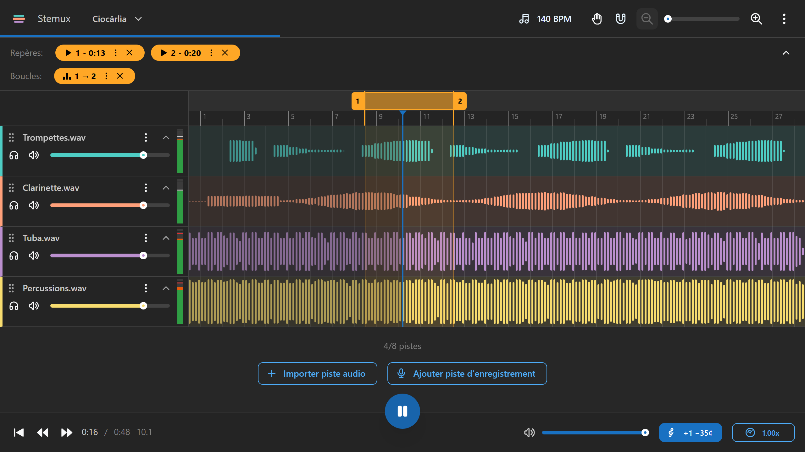
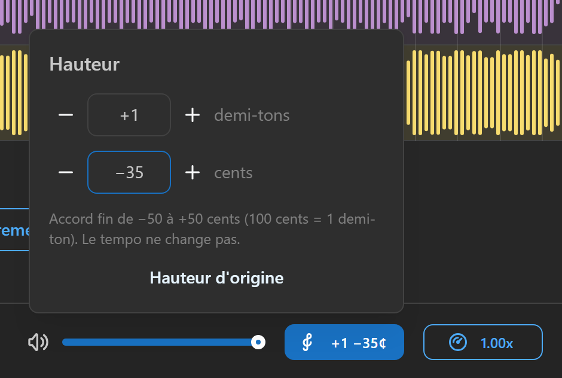
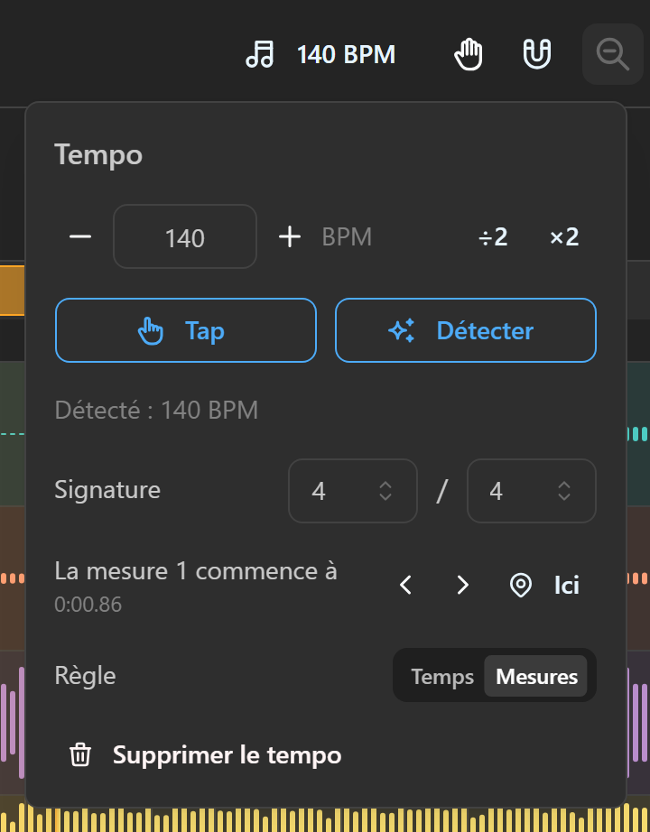
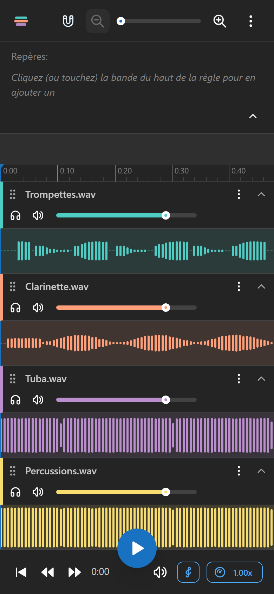

  

<h1 align="center">Stemux</h1>

  <b>Tes pistes, une par une, au tempo et au ton que tu veux.</b> 
  Le lecteur multipiste pour travailler un morceau instrument par instrument.

  <a href="https://app.stemux.fr"><b>Ouvrir l'application</b></a>
  ·
  <a href="#linstaller">L'installer</a>
  ·
  

---

Tu bosses un morceau et tu as les pistes séparées (les *stems*) : la batterie, la basse, les cuivres,
chacun dans son fichier. Dans un lecteur classique, tu ne peux pas couper ta partie pour jouer à sa place,
ralentir le passage qui coince, le reprendre en boucle vingt fois ni t'enregistrer par-dessus.

**Stemux fait tout ça dans le navigateur.** Tu déposes tes pistes, tu coupes ou isoles ce que tu veux,
tu poses une boucle sur le passage difficile, tu le ralentis, et tu joues.

  

  
  
  

## Ce qu'il sait faire

- **Toutes tes pistes, calées.** Jusqu'à 8 pistes (MP3, WAV, OGG, FLAC, M4A… tout ce que ton navigateur
  sait lire), jouées sur la même horloge : elles restent synchronisées à l'échantillon près, en boucle
  comme au ralenti.
- **Le mix sous la main.** Volume par piste (la molette marche aussi), solo et mute. Appui long sur solo :
  tu n'entends plus que cette piste. Appui long sur mute : tout revient. Sur ordinateur, un vumètre par
  piste.
- **Des boucles pour les passages durs.** Glisse sur le haut de la règle pour créer une boucle, tire ses
  bords pour l'ajuster, double-clic pour la jouer. Elle reboucle sans trou. Repères, couleurs, et
  « boucler à l'entrée » pour qu'elle s'active quand la lecture y arrive.
- **Ralentir sans changer le ton.** De 0,5x à 2x, la hauteur ne bouge pas.
- **Changer le ton sans changer le tempo.** Transposition en demi-tons (jusqu'à une octave) et accord fin
  en cents (±50). Pour jouer dans une autre tonalité, ou pour caler un enregistrement qui n'est pas au
  diapason de ton instrument (coucou les fanfares).
- **Tempo et mesures.** Tape le tempo, tapote-le, ou laisse Stemux le détecter. La règle compte alors en
  mesures, et les repères, boucles et clips s'aimantent sur les temps.
- **Enregistre-toi par-dessus.** Ajoute une piste d'enregistrement, arme-la, lance la lecture. La prise
  tombe en place : la latence du casque et du micro est compensée, et tu peux la mesurer en un clic dans
  les réglages. Réécoute, déplace, télécharge.
- **Retouche les clips.** En mode édition, déplace les pistes sur la timeline et rogne leur début ou leur
  fin, avec aimantation. Ctrl+Z si tu te trompes.
- **Un morceau, un projet.** Chaque morceau garde ses pistes, ses boucles, son tempo, sa hauteur et ses
  volumes. Rien à enregistrer : tout est sauvegardé au fil de l'eau.
- **Clair ou sombre, français ou anglais.** Thème clair, sombre ou selon le système ; la langue suit celle
  du navigateur.

## Au clavier

| Touche | Action |
|---|---|
| `Espace` | Lecture / pause |
| `←` `→` | Recule / avance de 5 s (maintenu : défile, de plus en plus vite) |
| `Ctrl + ←` | Retour au début |
| `Ctrl + Z` / `Ctrl + Maj + Z` | Annuler / rétablir (repères, boucles, clips) |
| `Ctrl + molette` | Zoom autour de la souris |
| `Alt` pendant un glisser | Sans aimantation |

## L'installer

Stemux est une application web installable, sans store ni compte :

- **Android (Chrome)** : ouvre [app.stemux.fr](https://app.stemux.fr), menu ⋮ puis
  « Installer l'application ».
- **iPhone (Safari)** : ouvre le site, bouton Partager puis « Sur l'écran d'accueil ».
- **Ordinateur (Chrome, Edge)** : l'icône d'installation au bout de la barre d'adresse.

Elle s'ouvre ensuite dans sa propre fenêtre, fonctionne hors ligne, et te prévient quand une nouvelle
version est prête.

## Bon à savoir

- **Stemux ne sépare pas un mix.** Il lit des pistes déjà séparées : exportées de ton logiciel, fournies
  avec une méthode, ou extraites avec un outil de séparation comme [Demucs](https://github.com/adefossez/demucs).
- **Pour enregistrer**, le micro doit être autorisé deux fois : par le téléphone pour le navigateur, puis
  par le site. Mets un casque, sinon le micro reprend les pistes.
- **Tes morceaux vivent dans ton navigateur.** Effacer les données du site les efface aussi, et ils ne
  passent pas d'un appareil à l'autre.

## Vie privée

Pas de compte, pas de pub, pas de pistage. Tes fichiers ne quittent jamais ton appareil : tout est lu et
stocké dans le navigateur.

## Contribuer

Idées, bugs, envies : ouvre une [issue](https://github.com/wollanup/stemux/issues).
Pour lancer le projet en local et comprendre comment il est construit, voir la
[documentation technique](docs/DEVELOPMENT.md).

## Licence

[MIT](LICENSE). Les bibliothèques utilisées et leurs licences sont listées dans
[THIRD-PARTY-LICENSES.md](THIRD-PARTY-LICENSES.md).
