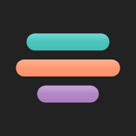

# Stemux
## Practice, mix and loop your stems

<div align="center">



**Practice smarter with isolated stems**

A modern, browser-based multi-track audio player designed for musicians who want to practice with full control over individual instrument tracks.

[✨ Features](#-features) • [🚀 Quick Start](#-quick-start) • [📖 User Guide](#-user-guide) • [🛠️ Tech Stack](#-tech-stack)

</div>

---

## ✨ Features

### 🎛️ **Advanced Track Controls**
- **Independent Volume Control** - Adjust each track's volume separately, plus master volume
- **Smart Solo System** 
  - Short press: Solo one track (mutes all others)
  - Long press: Exclusive solo (unmutes all + solos only selected track)
- **Intelligent Mute**
  - Short press: Toggle mute for one track
  - Long press: Unmute all tracks at once
- **Single Timeline** - One time ruler, one playhead and every clip at its place (like an audio editor)
- **Clip Editing** - Move clips and trim their start/end with the mouse, with snapping to markers, loops and other clips, and undo (Ctrl+Z)

### 🎵 **Multi-Piece Management**
- **Create Multiple Projects** - Organize your work into separate pieces/songs
- **Independent Storage** - Each piece saves its own tracks, loops, and settings
- **Quick Switching** - Access recent pieces from the dropdown menu (click "Stemux ▼")
- **Auto-Save** - Changes are automatically saved to your browser
- **Easy Management** - Rename, delete, or create new pieces from one place
- **Storage Overview** - See total space used by all your pieces

### 🔁 **Loop System**
- **Visual Timeline** - See your playback position in real-time
- **Easy Loop Creation** - Drag on the time ruler to create a loop, drag its edges to adjust it
- **Auto-Repeat** - Automatically loops back for focused practice on difficult sections
- **Smart Skip** - Return to loop start (or track start if no loop active)

### ⚡ **Playback Features**
- **Variable Speed** - 0.25x to 4.0x playback (perfect for learning complex parts)
- **Keyboard Shortcuts** - SPACE for play/pause (more coming soon!)
- **Precise Seeking** - Click anywhere on the waveform to jump
- **Synchronized Playback** - All tracks stay perfectly in sync

### 💾 **Storage & Compatibility**
- **Offline First** - Files stored locally in your browser (IndexedDB)
- **No Upload Required** - Everything stays on your device
- **PWA Support** - Install as a desktop/mobile app
- **Multiple Formats** - MP3, WAV, OGG, M4A, FLAC, AAC

### 🎨 **User Experience**
- **Dark/Light Mode** - Automatic theme based on system preference
- **Responsive Design** - Works on desktop, tablet, and mobile
- **Touch-Friendly** - Optimized for touchscreen devices
- **Rename Tracks** - Click track names to customize them
- **Internationalization** - Available in English and French

---


## 🚀 Quick Start

### 🌐 **Try it Online**
Visit [https://app.stemux.fr](https://app.stemux.fr) to start using Stemux immediately - no installation required!

### 💻 **Run Locally**

```bash
# Clone the repository
git clone https://github.com/yourusername/stemux.git
cd stemux/app

# Install dependencies
npm install

# Start development server
npm run dev
```

Open http://localhost:5173 in your browser.

### 📦 **Build for Production**

```bash
cd app
npm run build
npm run preview
```

### 🧪 **Checks & Tests**

```bash
cd app
npm run lint
npm run typecheck
npm test          # unit tests (Vitest), `npm run test:watch` while developing
npm run test:e2e  # UI tests (Playwright, Chromium with a fake microphone)
```

The same checks run on GitHub Actions for every push and pull request (`.github/workflows/ci.yml`).

### 🐳 **Docker Deployment**

```bash
# From project root
docker build -t stemux .
docker run -p 3000:3000 stemux
```

Access at http://localhost:3000

---

## 📖 User Guide

### Getting Started

1. **Load Your Tracks**
   - Drag & drop audio files onto the upload area
   - Or click to browse your files
   - Supports MP3, WAV, OGG, and more
   - Files are saved locally in your browser

2. **Control Playback**
   - Use the floating ▶️ button or press **SPACE**
   - Adjust speed with the speed control (0.25x - 4.0x)
   - Click waveforms to seek to specific positions

3. **Master Your Mix**
   - Adjust individual track volumes
   - Use solo to isolate instruments
   - Mute tracks you don't need
   - Control master volume from the bottom bar

### Managing Pieces

Organize your work into separate pieces (songs/projects):

1. **Quick Access** - Click **"Stemux ▼"** in the top bar to open the pieces menu
2. **Switch Pieces** - Select from your 10 most recent pieces
3. **Create New** - Click "Manage Pieces" → "New Piece" to start fresh
4. **Current Piece** 
   - Click the piece name to rename it
   - Each piece keeps its own tracks, loops, and settings
5. **Delete Old Work** - Remove pieces you no longer need

**Desktop:** See current piece name in top bar  
**Mobile:** First item in dropdown shows current piece

### Track Controls

| Icon | Control | Short Press | Long Press |
|------|---------|-------------|------------|
| 🎧 | Solo | Solo this track (mute others) | Exclusive solo (unmute all + solo only this) |
| 🔊 | Mute | Toggle mute for this track | Unmute all tracks |
| 🎚️ | Volume | Drag slider to adjust | - |

### Loop System

Perfect for practicing difficult sections:

1. **Open Loop Panel** - Click the 🔁 button (top-right)
2. **Set Loop Start** - Play to desired start point, click "Mark Loop Start"
3. **Set Loop End** - Continue playing, click "Mark Loop End"
4. **Practice** - Loop automatically plays the section repeatedly
5. **Toggle/Clear** - Enable/disable or clear the loop anytime

### Keyboard Shortcuts

| Key | Action |
|-----|--------|
| `SPACE` | Play / Pause |
| *(more coming soon!)* | |

### Tips & Tricks

💡 **Click track names** to rename them for better organization

💾 **Everything is offline** - No internet needed after initial load

⏮️ **Smart skip button** - Returns to loop start (or track start if no loop)

🎯 **Combine features** - Use solo + loop to laser-focus on specific instruments in specific sections

---

## 🛠️ Tech Stack

- **[React 19](https://react.dev/)** - UI framework
- **[TypeScript](https://www.typescriptlang.org/)** - Type safety
- **[Material-UI v7](https://mui.com/)** - Component library
- **[Web Audio API](https://developer.mozilla.org/en-US/docs/Web/API/Web_Audio_API)** - Audio processing
- **[Signalsmith Stretch](https://signalsmith-audio.co.uk/code/stretch/)** - Pitch-preserving speed change
- **[Zustand](https://zustand-demo.pmnd.rs/)** - State management
- **[Vite](https://vitejs.dev/)** - Build tool
- **[Vite PWA Plugin](https://vite-pwa-org.netlify.app/)** - Progressive Web App support
- **[i18next](https://www.i18next.com/)** - Internationalization

---

## 🎯 Use Cases

**Stemux is perfect for:**

- 🎸 **Guitarists** learning solos by isolating the guitar track
- 🥁 **Drummers** practicing with muted drums to play along
- 🎹 **Keyboardists** focusing on chord progressions
- 🎤 **Vocalists** practicing with instrumental-only mixes
- 🎼 **Music Students** analyzing arrangements by isolating parts
- 🎵 **Producers** reviewing stems before mixing

---

## 🌍 Internationalization

Currently available in:
- 🇬🇧 English
- 🇫🇷 French

Want to add your language? Contributions welcome!

---

## 🤝 Contributing

Contributions, issues, and feature requests are welcome!

1. Fork the project
2. Create your feature branch (`git checkout -b feature/AmazingFeature`)
3. Commit your changes (`git commit -m 'Add some AmazingFeature'`)
4. Push to the branch (`git push origin feature/AmazingFeature`)
5. Open a Pull Request

---

## 📝 License

This project is licensed under the MIT License - see the [LICENSE](LICENSE) file for details.

---

## 🙏 Acknowledgments

- **WaveSurfer.js** - Powered the waveforms of the first versions
- **Material-UI** - For the beautiful component library
- **Web Audio API** - For making this possible in the browser

---

<div align="center">

**Made with ❤️ and AI for musicians**

⭐ Star this repo if you find it useful!

</div>
